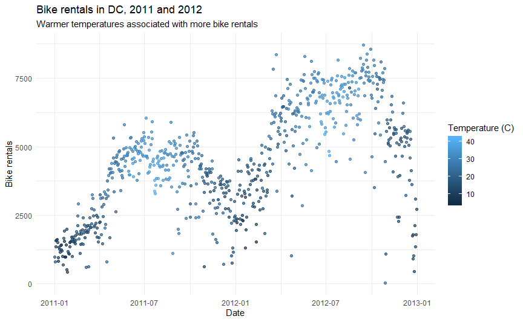

```{r photo, fig.margin = TRUE, echo = FALSE, fig.width=3, fig.cap="Photo by Viktor Kern on Unsplash"}

```

Bike sharing systems are new generation of traditional bike rentals where whole process from membership, rental and return back has become automatic. Through these systems, user is able to easily rent a bike from a particular position and return back at another position. Currently, there are about over 500 bike-sharing programs around the world which is composed of over 500 thousands bicycles. Today, there exists great interest in these systems due to their important role in traffic, environmental and health issues. 

Apart from interesting real world applications of bike sharing systems, the characteristics of data being generated by these systems make them attractive for the research. Opposed to other transport services such as bus or subway, the duration of travel, departure and arrival position is explicitly recorded in these systems. This feature turns bike sharing system into a virtual sensor network that can be used for sensing mobility in the city. Hence, it is expected that most of important events in the city could be detected via monitoring these data.

Source: [UCI Machine Learning Repository - Bike Sharing Dataset](http://archive.ics.uci.edu/ml/datasets/Bike+Sharing+Dataset)


# Packages

In this assignment we will work with the following packages. They should already 
be installed in your project, and you can load them with the following:

```{r load-packages, eval=TRUE, message=FALSE}
library(tidyverse)
```

# Data

The data include daily bike rental counts (by members and casual users) of Capital Bikeshare in Washington, DC in 2011 and 2012 as well as weather information on these days.

The original data sources are http://capitalbikeshare.com/system-data and http://www.freemeteo.com.

The codebook is below:

| Variable name    | Description 
|:--------|:-------------------------------------------------------------
| `instant`		| record index
| `dteday` 		| date
| `season` 		| season (1:winter, 2:spring, 3:summer, 4:fall)
| `yr` 		    | year (0: 2011, 1:2012)
| `mnth` 		  | month (1 to 12)
| `holiday` 	| whether day is holiday or not (extracted from http://dchr.dc.gov/page/holiday-schedule)
| `weekday` 	| day of the week
| `workingday`| if day is neither weekend nor holiday is 1, otherwise is 0.
| `weathersit`| 1: Clear, Few clouds, Partly cloudy, Partly cloudy
|             | 2: Mist + Cloudy, Mist + Broken clouds, Mist + Few clouds, Mist
|             | 3: Light Snow, Light Rain + Thunderstorm + Scattered clouds, Light Rain + Scattered clouds
|             | 4: Heavy Rain + Ice Pallets + Thunderstorm + Mist, Snow + Fog
| `temp` 			| Normalized temperature in Celsius. The values are divided by 41 (max)
| `atemp`			| Normalized feeling temperature in Celsius. The values are divided by 50 (max)
| `hum` 			| Normalized humidity. The values are divided by 100 (max)
| `windspeed`	| Normalized wind speed. The values are divided by 67 (max)
| `casual`		| Count of casual users
| `registered`| Count of registered users
| `cnt` 		  | Count of total rental bikes including both casual and registered

# Exercises

1. Load the dataset called `bikeshare-day.csv` that is located in the `data` folder with the `read_csv()` function. Save it as a data frame called `bike` in your environment.

```{r}
bike<-read_csv("data/bikeshare-day.csv")
bike

```


## Data wrangling

2. Recode the `season` variable to be a factor with meaningful level names as 
outlined in the codebook, with spring as the baseline level.

```{r}
bike <- bike %>% mutate(season = recode(factor(season), "1" = "winter", "2" = "spring", "3" = "summer", "4" = "fall"))
bike$season <- relevel(bike$season, ref='spring')
```


3. Recode the binary variables `holiday` and `workingday` to be factors with 
levels no (0) and yes (1), with no as the baseline level.

```{r}
bike <- bike %>% mutate(holiday = recode(factor(holiday), "0"="no","1"="yes"),
                        workingday = recode(factor(holiday), "0"="no","1"="yes"))
```


4. Recode the `yr` variable to be a factor with levels 2011 and 2012, with 2011 
as the baseline level.
```{r}
bike <- bike %>% mutate(yr = recode(factor(yr), "0"="2011", "1"="2012"))
```

5. Recode the `weathersit` variable as 1 - clear, 2 - mist, 3 - light precipitation, 
and 4 - heavy precipitation, with clear as the baseline.
```{r}
bike <- bike %>% mutate(weathersit = recode(factor(weathersit),
                                            "1" = "clear",
                                            "2"= "mist",
                                            "3"="light precipitation",
                                            "4"="heavy precipitation"))
```

6. Calculate raw temperature, feeling temperature, humidity, and windspeed as 
their values given in the dataset multiplied by the maximum raw values stated 
in the codebook for each variable. Instead of writing over the existing variables, 
create new ones with concise but informative names.
```{r}
bike <- bike %>% 
  mutate(raw_temp = temp*41,
         raw_atemp = atemp*50,
         raw_hum = hum*100,
         raw_windspeed = windspeed*67)
```


7. Check that the sum of `casual` and `registered` adds up to `cnt` for each record.
**Hint:** One way of doing this is to create a new column that takes on the value 
`TRUE` if they add up and `FALSE` if not, and then checking if all values in 
that column are `TRUE`s. But this is only one way, you might come up with another.
```{r}
bike %>%
  mutate(check = (cnt==casual+registered))%>%
  distinct(check)
```


## Exploratory data analysis

7. Recreate the following visualization, and interpret it in context of the data. 
*Hint: You will need to use one of the variables you created above. The temperature plotted is the feeling temperature.*

````{r plot-image, echo=FALSE, out.width='100%', eval = TRUE}

```

8. Create a visualization displaying the relationship between bike rentals and 
season. Interpret the plot in context of the data.


## Modelling

9. Fit a linear model predicting total daily bike rentals from daily temperature. 
Write the linear model, interpret the slope and the intercept in context of the 
data, and determine and interpret the $R^2$.

10. Fit another linear model predicting total daily bike rentals from daily 
feeling temperature. Write the linear model, interpret the slope and the intercept 
in context of the data, and determine and interpret the $R^2$. Is temperature or 
feeling temperature a better predictor of bike rentals? Explain your reasoning.

11. Fit a model predicting total daily bike rentals from season, year, whether 
the day is holiday or not, whether the day is a workingday or not, the weather 
category, temperature, feeling temperature, humidity, and windspeed, as well as 
the interaction between feeling temperature and holiday. Record adjusted $R^2$ 
of the model.

```{r}
mod11 <- lm(cnt~season+ yr+ holiday+ workingday+ weathersit+ raw_temp+ raw_atemp+ raw_hum+ windspeed+ raw_atemp*holiday, data=bike)
mod11%>%tidy()
mod11%>%glance()
```


12. Write the linear models for holidays and non-holidays. Is the slope of 
temperature the same or different for these two models? How about the slope 
for feeling temperature? Why or why not?

```{r}
bike_holiday <- bike %>%
      filter(holiday=="yes")
bike_nonholiday <- bike %>% filter(holiday=="no")

mod12 <- bike_nonholiday %>%
lm(cnt~season+ yr+ weathersit+ raw_temp+ raw_atemp+ raw_hum+ windspeed, data=.)

mod12%>% glimpse()
```


13. Interpret the slopes of season and feeling temperature. If the slopes are 
different for holidays and non-holidays, make sure to interpret both. If the 
variable has multiple levels, make sure you interpret all of the slope coefficients 
associated with it.

14. Interpret the intercept. If the intercept is different for holidays and 
non-holidays, make sure to interpret both.

15. According to this model, assuming everything else is the same, in which 
season does the model predict total daily bike rentals to be highest and 
which to be the lowest?

16. Perform the first step of backward selection by fitting a series of models, 
each with one explanatory variable removed from the model you fit in the previous 
exercise. Record adjusted $R^2$s of each of these models. Which model of these 
models, if any, gives the highest improvement over the model in the previous 
exercise?

